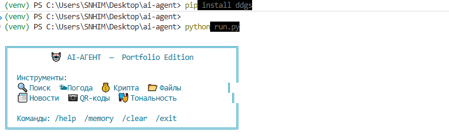
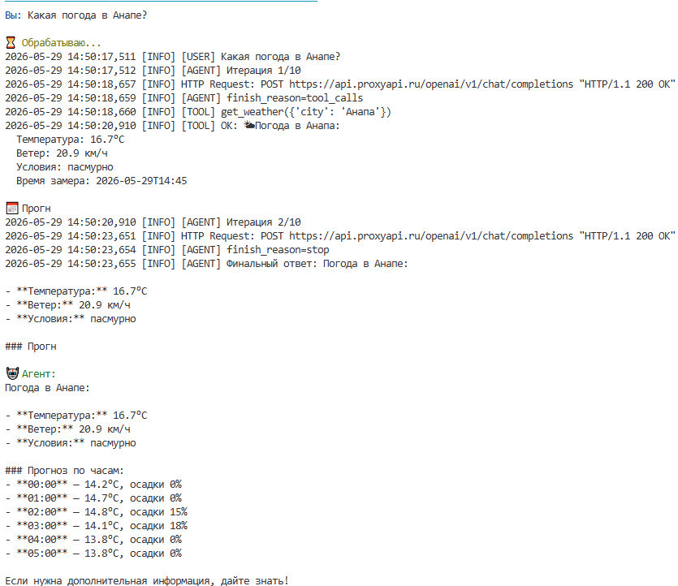
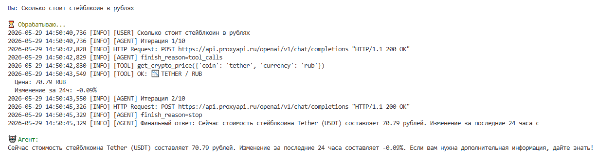
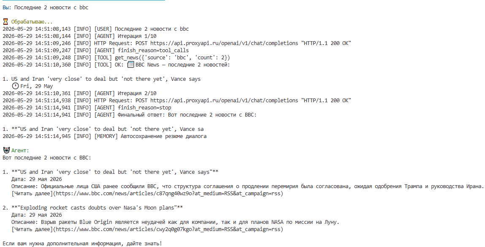
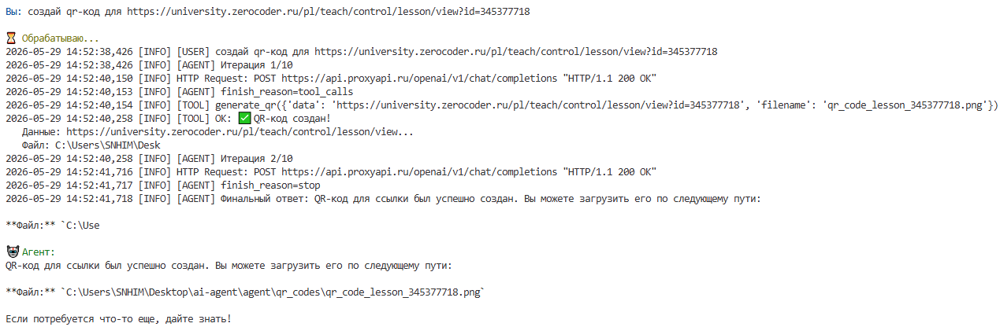
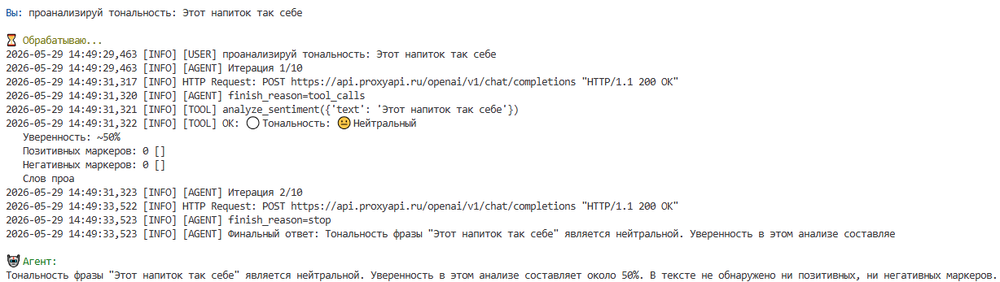

# 🤖 AI-Агент — Portfolio Edition

[](https://python.org)
[](https://openai.com)
[](LICENSE)

Полнофункциональный AI-агент на базе OpenAI с поддержкой прокси (Karing, ProxyAPI и др.).  
Агент самостоятельно выбирает инструменты, работает в цикле **Думаю → Действую → Отвечаю**.

---

## 🛠 Инструменты

| # | Инструмент | Описание |
|---|-----------|----------|
| 1 | 🔍 **Web Search** | Поиск через DuckDuckGo (без API-ключа) |
| 2 | 🌤 **Weather** | Погода + прогноз по часам (Open-Meteo) |
| 3 | 💰 **Crypto Price** | Курс крипты с изменением за 24ч (CoinGecko) |
| 4 | 📂 **File I/O** | Чтение, запись, просмотр файлов |
| 5 | 🧠 **Memory** | Долговременная память в `memory.json` |
| 6 | 💻 **Terminal** | Безопасные терминальные команды |
| 7 | 📰 **RSS News** ⭐ | Новости: lenta, ria, habr, techcrunch, bbc, coindesk |
| 8 | 📷 **QR Generator** ⭐ | Генерация QR-кодов → PNG-файл |
| 9 | 🎭 **Sentiment** ⭐ | Анализ тональности текста (RU + EN) |

---
## 📸 Демонстрация

### Запуск агента


### Погода и крипта



### Бонусные инструменты





## 🚀 Быстрый старт

### 1. Клонирование и установка

```bash
git clone https://github.com/your-username/ai-agent
cd ai-agent
python -m venv venv

# Windows
venv\Scripts\activate
# Linux/macOS
source venv/bin/activate

pip install -r requirements.txt
```

### 2. Настройка `.env`

```bash
cp .env.example .env
```

Открой `.env` и заполни:

```env
OPENAI_API_KEY=sk-your-key-here
OPENAI_BASE_URL=https://api.proxyapi.ru/openai/v1  # или твой прокси
MODEL_NAME=gpt-4o-mini
```

### 3. Запуск

```bash
python run.py
```
### Запуск через Docker
```bash
docker compose run agent


---

## 💬 Примеры запросов

```
Вы: Какая погода в Санкт-Петербурге?
Вы: Сколько стоит ethereum в рублях?
Вы: Последние 5 новостей с Habr
Вы: Создай QR-код для https://github.com/myrepo
Вы: Проанализируй тональность: "Этот продукт просто отличный!"
Вы: Найди информацию о LangChain и сохрани в файл summary.txt
```

---

## 🏗 Структура проекта

```
ai_agent/
├── agent/
│   ├── __init__.py      # экспорт run_agent
│   ├── agent.py         # ядро агента (цикл LLM + tools)
│   └── tools.py         # все 9 инструментов + схемы для OpenAI
├── files/               # файлы, созданные агентом
├── qr_codes/            # PNG-файлы с QR-кодами
├── memory.json          # долговременная память (авто)
├── agent.log            # лог работы агента (авто)
├── run.py               # CLI-интерфейс
├── requirements.txt
├── .env.example
└── README.md
```

---

## 🔧 Поддерживаемые прокси

| Прокси | BASE_URL |
|--------|----------|
| ProxyAPI | `https://api.proxyapi.ru/openai/v1` |
| OpenAI напрямую | `https://api.openai.com/v1` |
| Любой OpenAI-совместимый | указать свой URL |

---

## 📦 Зависимости

```
openai>=1.30.0
python-dotenv>=1.0.0
requests>=2.31.0
duckduckgo-search>=6.1.0
feedparser>=6.0.10
qrcode[pil]>=7.4.0
Pillow>=10.0.0
colorama>=0.4.6
```

---

## 📝 Лицензия

MIT — используй свободно.
